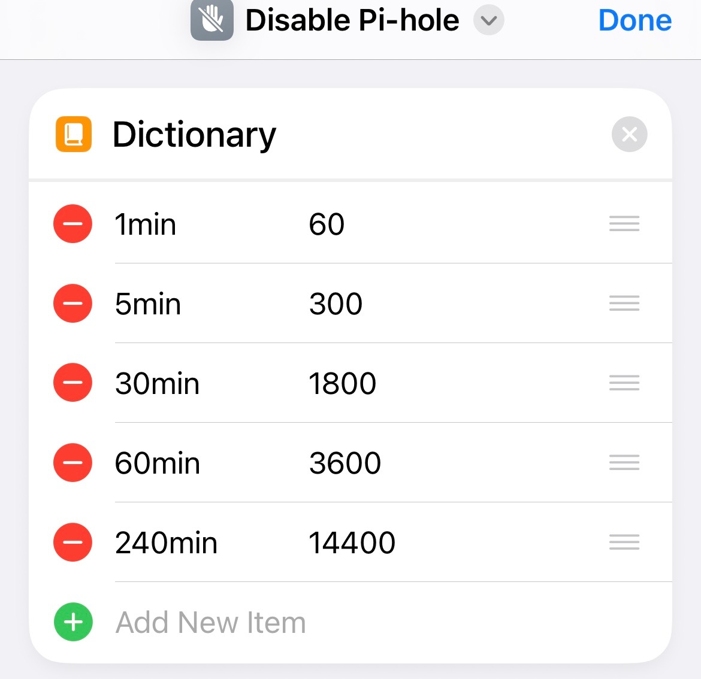
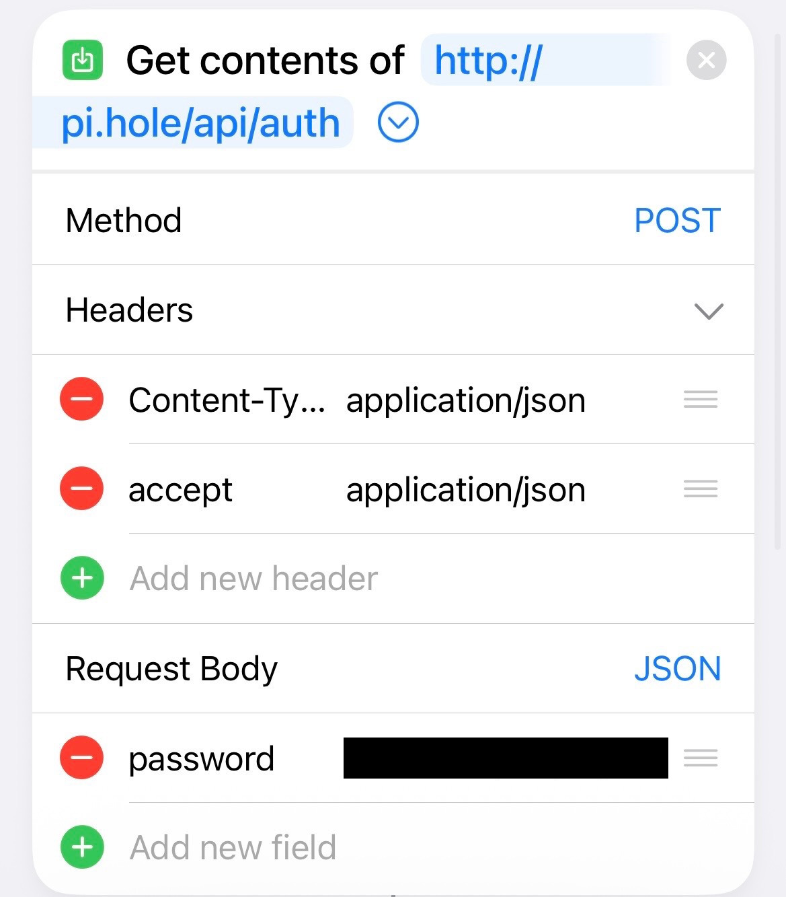
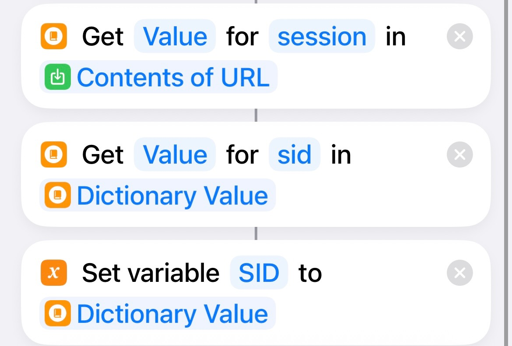
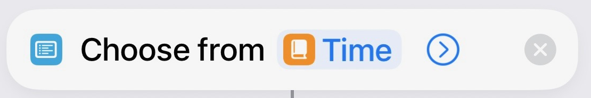
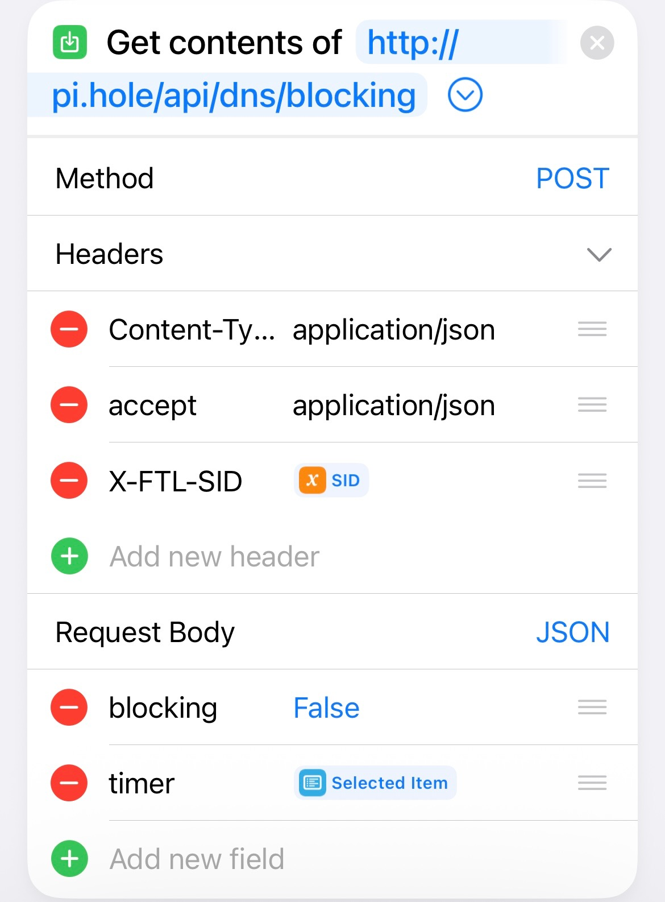
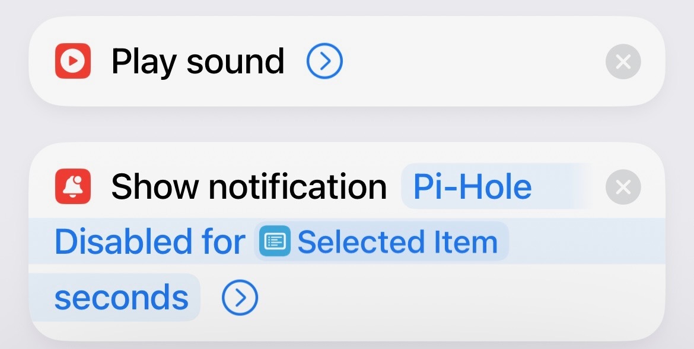

# Apple Shortcut to Disable Pi-Hole for Specified Time

With the recent changes made to how the API operates, the old method for disabling no longer works. 

The instructions below will provide guidance on how to use Apple Shortcuts to create a button which can disable the [Pi-hole](https://docs.pi-hole.net/) temporarily.

1. Navigate to "Apple Shortcuts" and create a new shortcut. Set the name by touching the "New Shortcut" at the top and selecting "Rename". Choose a new name or call it "Disable Pi-hole."
1. Go to "Search Actions" and look for "Dictionary". Select it and touch "Add New Item."
1. Several items are going to be added, all of which will be of value "Number." Enter the following values as shown below. These can be changed based on your own preference.

    | Key | Number |
    | --- | ------ |
    | 1min | 60 |
    | 5min | 300 |
    | 30min | 1800 |
    | 60min | 3600 |
    | 240min | 14400 |

    An example of what this should look like when you're done is below:

    

1. The initial request to authenticate with the server needs to be created. Search for "Get Contents of URL". Setup the options as demonstrated below.

    Get contents of `http://pi.hole/api/auth/`.
    
    **Method:** POST
    
    **Headers:**

    | Key | Text |
    | --- | ---- |
    | Content-Type | application/json |
    | accept | application/json |

    **Request Body:** JSON
    
    | Key | Text |
    | --- | ---- |
    | password | ADMIN_PIHOLE_PASSWORD |

    When you have completed the steps you should see something similar to below:

    

1. Now a new block will be added to gather the session information from the response. Search for "Get Dictionary Value."

    "Get `Value` for `session` in `Contents of URL`"

1. With the session information collected specific values need to be parsed. Search for "Get Dictionary Value" and configure it as follows:

    "Get `Value` for `sid` in `Dictionary Value`"

1. Finally, the `sid` is going to be assigned to a variable. Search for "Set Variable" and configure it with:

    "Set variable `SID` to `Dictionary Value`"

    After following the steps above, the following should be preset.

    

1. A new block will be setup to allow the selection of a time which will be used as a parameter in the next API call. Search for the block called "Choose from List."

    Configure it to choose from the dictionary created in step 3, which contained the time and seconds.

    After selecting the dictionary, touch the word "Dictionary" and change it to the variable name of `Time`.

    

1. Setup a new "Get Contents of URL" block and configure it as follows:

    Get contents of `http://pi.hole/api/dns/blocking`.
    
    **Method:** POST
    
    For the value `X-FTL-SID` the variable `SID` is selected.

    **Headers:**

    | Key | Text |
    | --- | ---- |
    | Content-Type | application/json |
    | accept | application/json |
    | X-FTL-SID | `SID` |

    **Request Body:** JSON
    
    | Key | Boolean |
    | --- | ---- |
    | blocking | False |

    For the timer option, the value being used is the item selected in step 8 by the user on runtime.    

    | Key | Number |
    | --- | ---- |
    | timer | `Selected Item` |

    When you have completed the steps you should see something similar to below:

    
 
1. A "Play Sound" block is added, but not required.

1. Lastly, a notification is displayed to the user with "Pi-Hole Disabled for `Selected Item` seconds" which is option.

    

With everything in place, a widget can be added to your home screen to simply push it, select the time, and disable the Pi-hole for the duration selected.

[Back to Home](https://blog.the1ntern.net)