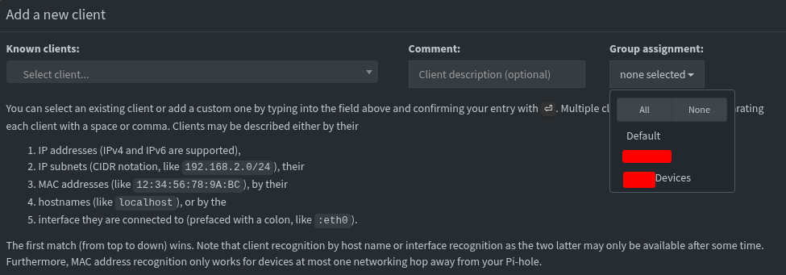
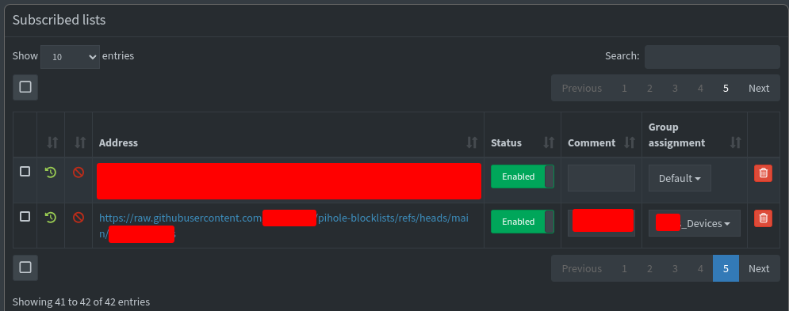
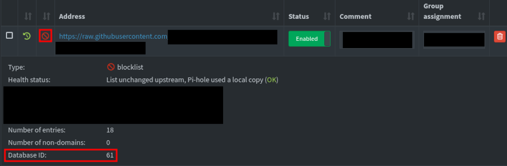
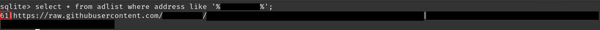

# Scheduling Domain Blocks for Device Groups with Pi-hole

The [Pi-hole](https://docs.pi-hole.net/) is one of the most useful projects that can be deployed within a home network. While some prior knowledge is needed to setup, there is so much documentation with makes the deployment of this a simple and quick experience.

With so many ads being present on website, this project cleans-up your internet experience. DNS traffic is filtered through the device and can aid in the blocking of these ads along with the option to create/pull from custom block lists.

Something that I have wanted to explore is the option to schedule when a block is added/removed. There is already great resources for this which can be found in [References](#references) but I wanted to go through and document my experience as well. 

# Process

1. Create a list of domains that are intended to be blocked. This can be placed on a public GitHub repository. An example of this type of file can be found [here](https://raw.githubusercontent.com/thegreatape/pihole-blocklists/main/thomas/always-blocked.hosts). An example is below as well:

    ```
    0.0.0.0 www.cnn.com
    0.0.0.0 www.foxnews.com
    0.0.0.0 www.reddit.com
    ```

1. Create a new group by navigating to "Groups" or the path `https://pihole.local/admin/groups`.

1. Add devices by their MAC address to this group using the "Clients" dashboard (`https://pihole.local/admin/groups/clients`). 

    

    You may want to add the device to "Default" and the new group created so that ads will continue to be blocked along with your scheduled blocks.

1. Add a new block list at `https://pihole.local/admin/groups/lists` which points to the custom list created earlier. Assign the list to the group created in earlier steps. You will likely not want to include **default** here as it would impact other devices.

    

1. SSH into your RaspberryPi and pull the contents for the blocklists.

    ```bash
    ssh pi@pihole.local
    pihole -g
    ```

1. Install `sqlite3` which will be used to interact with the Pi-hole database.

    ```bash
    sudo apt install sqlite3 -y
    ```

1. In order to schedule when a blocklist is enabled/disabled the SQLite database used will be manipulated. To do so, the ID of the blocklist is needed. Two options can be used to find this ID. 

    1. Navigate to `https://pihole.local/admin/groups/lists` and find the blocklist added. Click on the "🚫". The value "Database ID" is what will be used.
    
        

    1. View the ID directly from the database.
    
    ```bash
    sqlite3 /etc/pihole/gravity.db
    ```

    ```sql
    /*Swap "custom_repository" with a unique string from the repository you are using*/
    .tables
    select * from adlist where address like '%custom_repository%';
    .quit
    ```
    
    

1. With the ID of the blocklist that is intended to be used collect, the script to facilitate the database changes can be created.

    ```bash
    touch /home/pi/block-tool.sh
    ```

    Within the file `block-tool.sh` the following content is added.

    ```bash
    #!/bin/bash
    
    export PATH="$PATH:/usr/sbin:/usr/local/bin/"
    
    blocklist="$2"
    
    if [[ "$1" == "block" ]]; then
    	echo "[+] Block sites..."
    	sudo sqlite3 /etc/pihole/gravity.db "update adlist set enabled = true where id = ${blocklist};"
    elif [[ "$1" == "unblock" ]]; then
    	echo "[+] Unblocking sites..."
    	sudo sqlite3 /etc/pihole/gravity.db "update adlist set enabled = false where id = ${blocklist};"
    else
    	echo "[!] Unknown option."
    fi
    
    sudo pihole reloaddns
    ```

1. Using `chmod` the script will be made executable. 

    ```bash
    chmod +x /home/pi/block-tool.sh
    ```
 
    This script accepts to arguments, either block/unblock and the ID of the adlist. An example execution would be `./block-tool.sh block 61`.

1. Last step is to create 2 cronjobs, one to enable the block and one to disable on the chosen schedule. A tool which can assist in setting this schedule is [Cronitor](https://crontab.guru/). Execute `sudo crontab -e` and create new jobs. Example below:

    ```bash
    # At 07:00 on Saturday
    0 7 * * 6 bash -lc "/home/pi/block-tool.sh block 61"
    # At 00:00 on Sunday
    0 0 * * 0 bash -lc "/home/pi/block-tool.sh unblock 61"
    ```
    
    Cron will use the timezone configured on the device, to check this use `timedatectl`.

1. At this point everything can be configured, modified, and added to at your choosing. Domains will be blocked and unblocked on schedule for specific devices.

## References

1. https://thegreata.pe/articles/2021/02/28/pihole/

[Back to Home](https://blog.the1ntern.net)